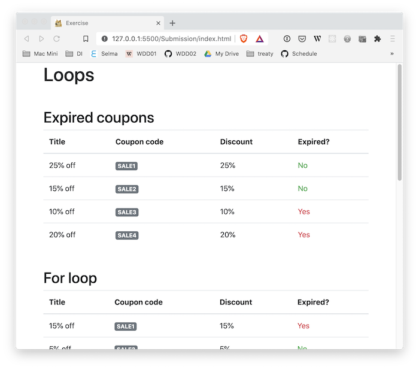
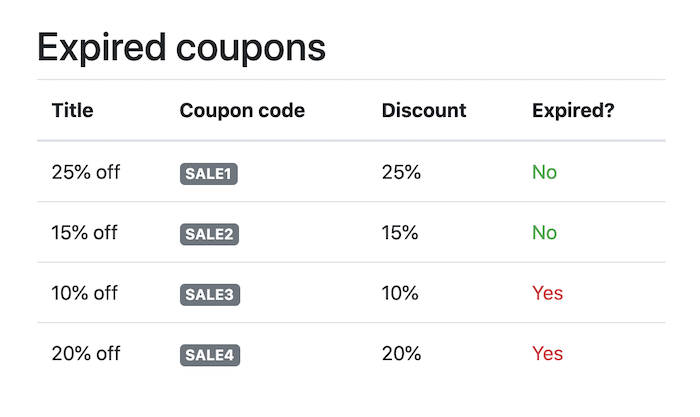
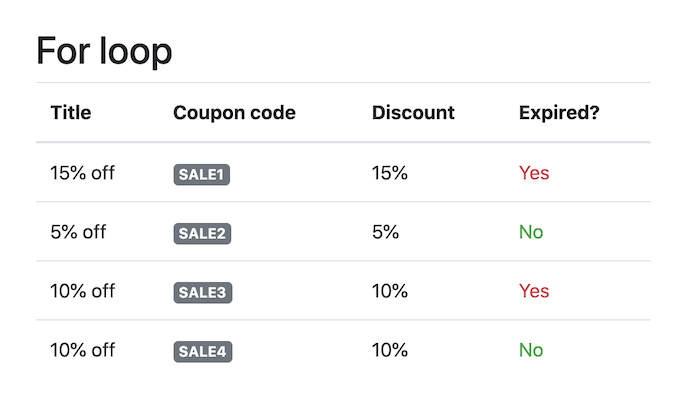
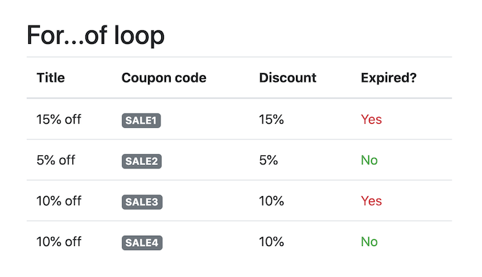

# 01 Exercise - Introduction to JavaScript Loops

## Brief

Use JavaScript loops to iterate over an array of coupons, and calculate if the coupons have expired or not



## Rationale

Looping is a fundamental programming concept and is required to write efficient software. In JavaScript, there are many types of loops, the most common is a `for` loop, and also the newer `for...of` loop.

## Instructions Part A - Add expired property to coupons

<details>
  <summary>Add expired property to coupons</summary>
  <br>

There is an existing array declared on the `couponsPartA` variable. Each coupon has an expiry date (`expiredAt`), and we need to display if the coupon has expired or not.

1. Find the `Part A` section in `Submission/script.js`
2. Find the `couponsPartA` array. For each item in this array, you need to manually add a new property named `expired`. The first item is done for you, complete the code so there is an `expired` property added to the other three coupons

**Acceptance criteria**

- The `couponsPartA` array contains all of the coupons, with an additional `expired` property
- The value of the `expired` property correctly determines if a coupon is expired or not
- The _Expired coupons_ table on the web page matches the screenshot below

  

</details>

## Instructions Part B - `for` loop

<details>
  <summary>For loop</summary>
  <br>

There is an existing array declared on the `couponsPartB` variable. Each coupon has an expiry date (`expiredAt`), and we need to display if the coupon has expired or not.

1. Find the `Part B` section in `Submission/script.js`
2. Using a [for loop](https://developer.mozilla.org/en-US/docs/Web/JavaScript/Reference/Statements/for), loop over the `couponsPartB` array
3. In each loop iteration, get a reference to the coupon object. Add a new property to this `coupon` object named `expired`.
4. The value of the `expired` property should check if the expiry time is greater than the time right now. This can be done the same way as in Part A. Use the following code snippet as an example:

   ```js
   expired: coupon.expiresAt > new Date().getTime();
   ```

   Note: If you would like more information you can read [`getTime()` on MDN](https://developer.mozilla.org/en-US/docs/Web/JavaScript/Reference/Global_Objects/Date/getTime)

**Acceptance criteria**

- The `couponsPartB` array contains all of the coupon objects, with an additional `expired` property
- The value of the `expired` property correctly determines if a coupon is expired or not
- A `for` loop is used to update the objects inside the `couponsPartB` array
- The _For loop_ table on the web page matches the screenshot below

  

</details>

## Instructions Part C - `for...of` loop

<details>
  <summary>For...of loop</summary>
  <br>

1. Find the `Part C` section in `Submission/script.js`
2. Using a [for...of loop](https://developer.mozilla.org/en-US/docs/Web/JavaScript/Reference/Statements/for...of), loop over the `couponsPartC` array
3. In each loop iteration, get a reference to the coupon object. Add a new property to this `coupon` object named `expired`.
4. Like in Part A and B, the value of the `expired` property should check if the expiry time is greater than the time right now.

**Acceptance criteria**

- The `couponsPartC` array contains all of the coupon objects, with an additional `expired` property
- The value of the `expired` property correctly determines if a coupon is expired or not
- A `for...of` loop is used to update the objects inside the `couponsPartC` array
- The _For...of loop_ table on the web page matches the screenshot below

  

</details>

---

# Submit your Exercise

- [ ] Commits are pushed to GitHub
- [ ] Automated tests pass in GitHub

---

## Exercise answer walkthrough

- [Introduction to Loops exercise walkthrough](https://www.loom.com/share/6b072b7398c24383b3e959ef907ee5a0)
